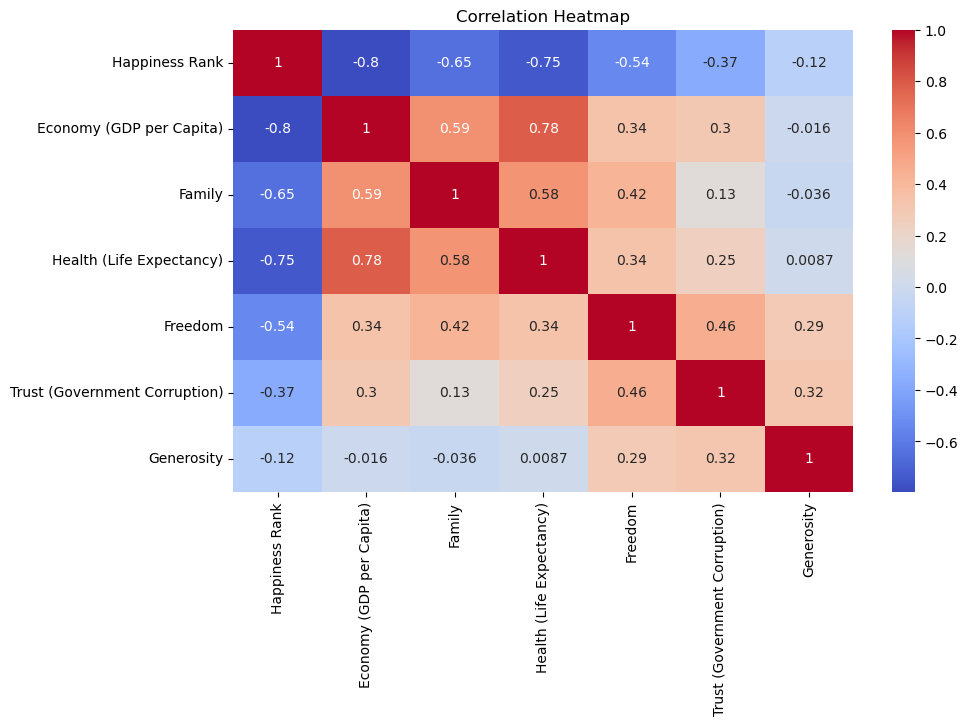
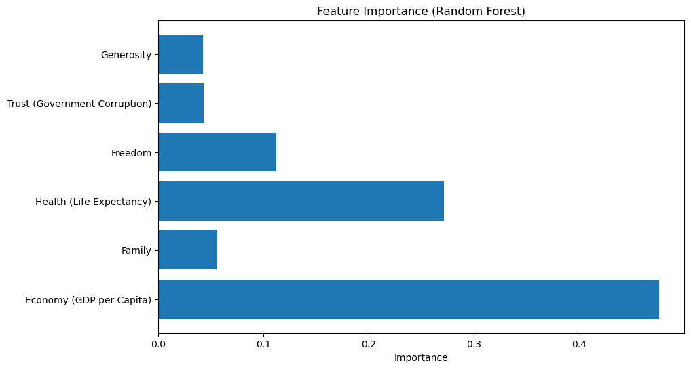
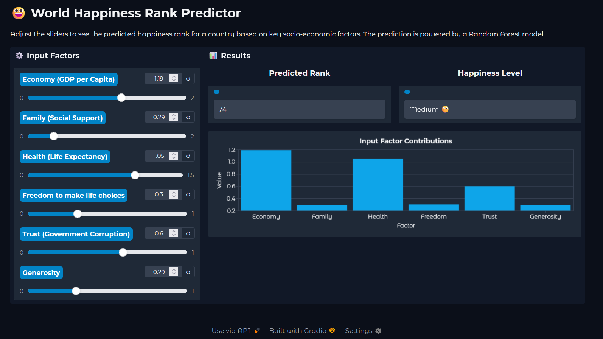

# 😃 World Happiness Rank Predictor

This project is a **machine learning application** that predicts the **World Happiness Rank** of a country based on six key socio-economic factors. The prediction is powered by a **Random Forest Regressor** trained on the **World Happiness Report dataset (2015-2019)**.

The app features an **interactive web interface** built with **Gradio**, allowing users to adjust input factors and see the predicted happiness rank in **real-time**.  

---
## LIVE LINK
    # [Live link](https://huggingface.co/spaces/GokulV/happines-prediction)  

## 🚀 Features

- **Interactive Predictions:** Use sliders to adjust six input factors and see updated predictions instantly.  
- **Real-time Visualization:** A bar chart visualizes the contribution of each factor. 📊  
- **Qualitative Feedback:** Predictions include a descriptive label (e.g., "Very High 😊", "Medium 😐").  
- **Professional UI:** Clean, modern, and responsive interface built with **Gradio**.  
- **Data-Driven:** Trained on **5 years of consolidated happiness data**.  

---

## 🛠️ Tech Stack

- **Backend:** Python 🐍  
- **Machine Learning:** Scikit-learn, Pandas, NumPy  
- **Web Framework / UI:** Gradio  
- **Data:** World Happiness Report (2015-2019)  

---

## ⚙️ Setup & Installation

1. **Clone the repository:**
```bash
git clone <https://github.com/Gokul-bit165/Happiness-prediction.git>
cd <Happiness-prediction>
```

2. **Create a virtual environment:**
```bash
python -m venv venv
# Activate environment
# Linux/Mac: source venv/bin/activate
# Windows: venv\Scripts\activate
```

3. **Install dependencies:**  
Create a `requirements.txt` with:
```
pandas
numpy
scikit-learn
gradio
```
Then run:
```bash
pip install -r requirements.txt
```

4. **Ensure required files are present in the root directory:**
- `best_model.pkl` (trained model)  
- `combined_happiness_data.csv` (dataset)  
- `app.py` (Gradio application script)  

---

## ▶️ Running the Application
Launch the app with:
```bash
python app.py
```
The Gradio interface will be available at the local URL provided (e.g., `http://127.0.0.1:7860`).  
A **temporary public link** will also be generated in the terminal:  
```
Running on public URL: https://huggingface.co/spaces/GokulV/happines-prediction
```

---

## 📊 Data Analysis & Visualizations

### 1️⃣ Correlation Matrix
A heatmap shows correlations between variables.  
- **Economy, Health, and Family** strongly correlate with better (lower) Happiness Rank.  

*Example plot:*  
  

---

### 2️⃣ Feature Importance
Random Forest model highlights the **most important predictors**:  
- Economy (GDP per Capita) 💰  
- Health (Life Expectancy) ❤️  

*Example plot:*  
  

---

### 3️⃣ Interactive App UI
*Example screenshot:*  
  

---

## 🤖 Model Comparison & Validation Metrics

Several regression models were evaluated. The Random Forest Regressor performed the best.  

| Model                     | R² (Train) | R² (Test) | RMSE (Test) |
|----------------------------|------------|-----------|-------------|
| Linear Regression          | 0.72       | 0.65      | 25.13       |
| Ridge Regression           | 0.71       | 0.66      | 24.85       |
| Lasso Regression           | 0.70       | 0.64      | 25.42       |
| Decision Tree Regressor    | 0.85       | 0.75      | 21.88       |
| **Random Forest Regressor**| 0.91       | 0.79      | 20.51       |
| Gradient Boosting Regressor| 0.88       | 0.78      | 21.29       |

**Conclusion:**  
- The **Random Forest Regressor** achieved the highest R² and lowest RMSE on the test set.  
- Economy and Health are the most important features.  
- The model captures non-linear relationships and provides robust predictions.  

---

## 📁 Project Structure

```
.
├── app.py                     # Main Gradio application script
├── best_model.pkl             # Trained machine learning model
├── combined_happiness_data.csv# Consolidated dataset (2015-2019)
├── notebooks/
│   ├── combine.ipynb          # Notebook for data combination
│   ├── data-visualization.ipynb # EDA and plots
│   ├── eda.ipynb              # Initial exploratory data analysis
│   └── model_validation.ipynb # Model training & evaluation
└── README.md                  # This file
```

---

## 📌 References

- [World Happiness Report](https://worldhappiness.report/)  
- Scikit-learn Documentation: [https://scikit-learn.org/stable/](https://scikit-learn.org/stable/)  
- Gradio Documentation: [https://gradio.app/](https://gradio.app/)  

---

## 🎯 Final Note

This application allows **interactive exploration** of factors that influence a country's happiness. Users can experiment with scenarios and see how changes in Economy, Health, Family, Freedom, Generosity, and Corruption perception affect the predicted happiness rank. 🌎✨
